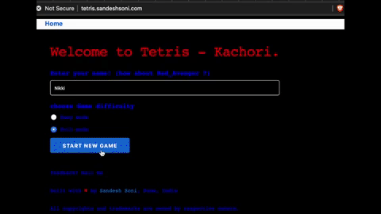

# (Tetris - Kachori)

This is my entry in [Phoenix Phrenzy](https://phoenixphrenzy.com), showing off what [Phoenix](https://phoenixframework.org/) and [LiveView](https://github.com/phoenixframework/phoenix_live_view) can do.

# Tetris Kachori
- The video to "my journey building tetris Kachori is posted on youtube" (It will answer most of your questions)

# Improvements / Opinions needed.
- How to bring down the length of every moment tetris shape is moved or added.
- How to use phx-update=append in this code. If valid.

# Versions
- LiveView. Previously it used non-hex package Url. Now updated to 0.3.1

# what is Kachori?
- Kachori is one of famous Indian Snack.
- It taste tangy, served with sweet and spicy chutney/sause.
- pic of Kachori.
- Youtube video Link. https://youtu.be/5eBJR81Ge8k

# About me
- Myself Sandesh Soni
- Lives in Pune, India
- Independent consultant / Freelancer

# Reach me
- I can be reached on Twitter https://twitter.com/iamsandeshsoni
- LinkedIn - https://www.linkedin.com/in/sandeshsoni
- email - hello+tk@sandeshsoni.com
- Github - https://github.com/sandeshsoni/
- website - https://sandeshsoni.com
- FREE course - https://www.sandeshsoni.com/elixir-phoenix-liveview-build-tetris-kachori-game-free-course/

